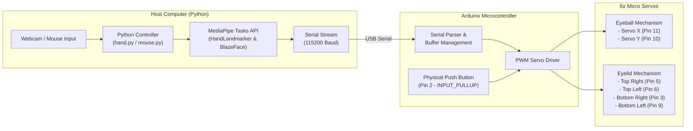

# EyeMech: Animatronic Robotic Eyes with Arduino & Computer Vision

[](https://www.arduino.cc/)
[](https://www.python.org/)
[](https://developers.google.com/mediapipe)
[](https://opencv.org/)

An interactive, 6-Degree-of-Freedom (6-DOF) animatronic eye mechanism powered by an Arduino microcontroller and computer vision in Python. The system delivers realistic, synchronized eyeball movement and 4-quadrant eyelid articulation with support for real-time webcam tracking (hand and face tracking via MediaPipe Tasks API) as well as desktop mouse/keyboard control.

---

## Table of Contents

- [Features](#features)
- [System Architecture](#system-architecture)
- [3D Models & Mechanical Design Attribution](#3d-models--mechanical-design-attribution)
- [Hardware Setup & Pinout](#hardware-setup--pinout)
- [Serial Communication Protocol](#serial-communication-protocol)
- [Repository Structure](#repository-structure)
- [Getting Started](#getting-started)
  - [1. Arduino Firmware Setup](#1-arduino-firmware-setup)
  - [2. Python Environment Setup](#2-python-environment-setup)
  - [3. Running the Controllers](#3-running-the-controllers)
- [Operational Modes](#operational-modes)
  - [Hand & Face Tracking Mode](#hand--face-tracking-mode)
  - [Mouse & Keyboard Mode](#mouse--keyboard-mode)
  - [Basic Calibration Mode](#basic-calibration-mode)
- [Safety & Power Considerations](#safety--power-considerations)
- [Troubleshooting](#troubleshooting)
- [License & Credits](#license--credits)

---

## Features

- **6-Servo Articulation:**
  - 2 Servos for eyeball pitch (Y-axis) and yaw (X-axis).
  - 4 Independent servos for individual quadrant eyelid control (Top-Left, Top-Right, Bottom-Left, Bottom-Right) for natural, symmetrical blinking and expressive squinting.
- **AI Hand Tracking & Fist Recognition (MediaPipe Tasks API):**
  - Tracks palm center (landmark 9) to steer eye gaze in real time.
  - Recognizes fist gestures to smoothly close and lock eyelids.
  - Releases eyelids open when fingers unfurl.
- **Fallback Face Detection (BlazeFace):**
  - Seamlessly switches to face tracking when no hands are in the camera frame, maintaining engaging eye contact.
- **Autonomous & Manual Blinking:**
  - Autonomous random blinking algorithm mimicking natural human eye behavior.
  - Hardware push-button support on digital pin 2 for manual blink triggering.
  - Keyboard shortcut (`B` key) support in desktop mouse mode.
- **High-Speed Serial Protocol:**
  - 115200 baud communication with stream-clearing backlog handling to ensure near-zero latency and responsive servo movement.

---

## System Architecture



---

## 3D Models & Mechanical Design Attribution

> [!IMPORTANT]
> **Design Credits & Origin:**
> The 3D-printable CAD models and mechanical mechanism files contained in the [`Models/`](Models/) folder were **not designed by me**. 
>
> * **Original Designer:** **[Will Cogley](https://www.willcogley.com/)**
> * **Design License:** [Creative Commons Attribution-NonCommercial-ShareAlike 4.0 International License (CC BY-NC-SA 4.0)](http://creativecommons.org/licenses/by-nc-sa/4.0/)
> * **Commercial Usage:** If you wish to use the 3D models in a commercial application, please contact the original creator directly at `enquiries@willcogley.com`.

The [`Models/`](Models/) directory includes:
* **[`Models/Stl Files/`](Models/Stl%20Files/):** All 3D-printable STL files required to build the animatronic assembly (main chassis, sub-base, servo blocks, eyeball holders, ball-and-socket forks, linkages, and eyelids).
* **[`Models/Reference/`](Models/Reference/):** Visual assembly references, servo mapping layouts, hole guides, and wiring diagrams to assist with mechanical assembly.
* **[`Models/License.html`](Models/License.html):** The original Creative Commons license document for the 3D assets.

---

## Hardware Setup & Pinout

### Required Components
- 1x Arduino Uno, Nano, or compatible board
- 6x Micro Servos (e.g., SG90 or MG90S metal-gear servos)
- 1x Momentary push button
- 1x External 5V DC Power Supply (minimum 2A recommended)
- 3D-printed Eye Mechanism chassis and linkages (from the `Models/` directory)
- Common ground jumper cables

### Pin Mapping Table

| Component | Pin | Default / Center | Safe Range / Motion Limits | Description |
|---|:---:|:---:|:---:|---|
| **Eyeball X (Yaw)** | `D11` | 60° | 40° – 140° | Horizontal eye movement |
| **Eyeball Y (Pitch)** | `D10` | 30° / 50° | 10° – 50° (Hand) / 0° – 90° (Mouse) | Vertical eye movement |
| **Top Right Eyelid** | `D5` | 100° (Open) | 100° (Open) → 140° (Closed) | Upper-right eyelid servo |
| **Top Left Eyelid** | `D6` | 100° (Open) | 100° (Open) → 60° (Closed) | Upper-left eyelid servo |
| **Bottom Right Eyelid** | `D3` | 40° (Open) | 40° (Open) → 0° (Closed) | Lower-right eyelid servo |
| **Bottom Left Eyelid** | `D9` | 40° (Open) | 40° (Open) → 80° (Closed) | Lower-left eyelid servo |
| **Push Button** | `D2` | `HIGH` (Pull-Up) | `LOW` on Press | Trigger blink manually |

> [!CAUTION]
> **Power Notice:** Do **NOT** power all 6 servos directly from the Arduino's onboard 5V pin. Micro-servos under load will draw peak currents causing Arduino brownout resets. Power the servos from an external 5V / 2A–3A power supply, and connect the external supply's ground (`GND`) to the Arduino's ground (`GND`).

---

## Serial Communication Protocol

The Arduino firmware listens for newline-delimited (`\n`) ASCII strings over USB Serial at **115200 baud** (or **9600 baud** in basic calibration sketch):

| Command Payload | Example | Action |
|---|:---:|---|
| `<AngleX>,<AngleY>\n` | `90,30\n` | Updates horizontal and vertical eyeball angles within validated limits. |
| `B\n` | `B\n` | Triggers a smooth, interpolated blink animation. |
| `C\n` | `C\n` | Locks eyelids in the closed state (triggered when fist is detected). |
| `O\n` | `O\n` | Unlocks eyelids back to open position (when fist is released). |

---

## Repository Structure

```
EyeMech/
├── .gitignore
├── README.md
├── Models/                                              # 3D Mechanical assets (Designed by Will Cogley)
│   ├── License.html                                     # CC BY-NC-SA 4.0 License for 3D assets
│   ├── Reference/                                       # Wiring, servo indexing & assembly guides
│   └── Stl Files/                                       # 3D printable STL files
├── Basic movment/
│   └── basic_eyes_movement/
│       └── basic_eyes_movement_copy_20261008162838.ino  # Baseline calibration sketch
└── Python codes/
    ├── Hand/
    │   ├── hand.py                                      # MediaPipe Tasks vision tracker (AI)
    │   └── arduino/
    │       └── hand/
    │           └── hand.ino                             # Arduino firmware for Hand mode
    └── Mouse/
        ├── mouse.py                                     # Desktop mouse & keyboard controller
        └── arduino/
            └── mouse/
                └── mouse.ino                            # Arduino firmware for Mouse mode
```

---

## Getting Started

### 1. Arduino Firmware Setup

1. Open the [Arduino IDE](https://www.arduino.cc/en/software).
2. Choose your preferred sketch based on mode:
   - For Hand & Face tracking: Open `Python codes/Hand/arduino/hand/hand.ino`.
   - For Mouse & Keyboard control: Open `Python codes/Mouse/arduino/mouse/mouse.ino`.
3. Select your board (e.g. *Arduino Uno*) and the correct COM port under **Tools > Port**.
4. Click **Upload**.

### 2. Python Environment Setup

Install Python 3.10 or newer, then install the required Python packages:

```bash
pip install opencv-python mediapipe pyserial pyautogui keyboard
```

> [!NOTE]
> `hand.py` is built using the latest **MediaPipe Tasks API** (`mediapipe >= 0.10.31` / `1.1.0+`). On the first run, `hand.py` automatically downloads the required lightweight model files (`hand_landmarker.task` and `blaze_face_short_range.tflite`) into the local directory.

### 3. Running the Controllers

Check the COM port assigned to your Arduino (e.g., in Device Manager or Arduino IDE). Update the `PORT` variable inside `hand.py` or `mouse.py`:

```python
PORT = 'COM21'  # Change to your Arduino COM port (e.g., 'COM3', '/dev/ttyUSB0')
```

---

## Operational Modes

### Hand & Face Tracking Mode

Run the camera-based tracking script:

```bash
cd "Python codes/Hand"
python hand.py
```

* **Palm Tracking:** Hold your hand in front of the camera. The robotic eyes will smoothly follow your palm center.
* **Fist Gesture (Eyelid Lock):** Close your fingers into a fist. The eyes will close and stay shut until you reopen your hand.
* **Face Fallback:** Drop your hand. The camera will locate your face and center the gaze on your head.
* **Auto-Blink:** When eyes are open, the robot periodically blinks at random intervals.
* **Exit:** Press <kbd>ESC</kbd> in the camera window.

### Mouse & Keyboard Mode

Run the desktop mouse tracker:

```bash
cd "Python codes/Mouse"
python mouse.py
```

* **Cursor Following:** Move your mouse anywhere on your monitor. Screen pixel coordinates are mapped dynamically to the servo angular range.
* **Keyboard Blink:** Press <kbd>B</kbd> on your keyboard to trigger an instant blink.
* **Exit:** Press <kbd>Ctrl</kbd> + <kbd>C</kbd> in your terminal.

### Basic Calibration Mode

Located in `Basic movment/basic_eyes_movement/`, this sketch is designed to test servo center points, confirm mechanical linkage clearances, and verify eyelid travel limits before connecting computer vision.

---

## Safety & Power Considerations

1. **Mechanical Clearance:** Before connecting linkages to the servo horns, power on the servos to let them reach their neutral/default angles. Attaching horns at wrong offsets can cause mechanical binding.
2. **Current Spikes:** A 6-servo mechanism can easily pull 1.5A–2.5A during rapid directional shifts. Always verify supply voltage and decouple servo power lines with a large electrolytic capacitor (e.g., 470µF – 1000µF across 5V and GND) if jitter occurs.
3. **Software Limits:** Keep the software angle clamping intact in the `.ino` sketches to protect 3D-printed linkages from over-rotation.

---

## Troubleshooting

- **`Failed to connect: could not open port 'COMxx'`**
  - Ensure the Arduino IDE Serial Monitor is closed (only one program can use a serial port at a time).
  - Check that the `PORT` variable in the Python script matches your Arduino's current port.
- **`ModuleNotFoundError: No module named 'mediapipe.python'` or `AttributeError: module 'mediapipe' has no attribute 'solutions'`**
  - Older scripts relied on the deprecated `mp.solutions` API. This repository uses the updated `mediapipe.tasks.python.vision` API. Verify you are running the latest `hand.py` from this repo.
- **Servos twitching or Arduino restarting when blinking**
  - Insufficient power supply. Switch from USB power to a dedicated external 5V 2A+ power source. Make sure grounds are tied together.

---

## License & Credits

- **Software Code:** The Arduino sketches and Python tracking scripts in this repository are open-source under the [MIT License](https://opensource.org/licenses/MIT).
- **3D Mechanical Models:** The 3D models and assembly references in the [`Models/`](Models/) directory are designed by **Will Cogley** and distributed under the [Creative Commons Attribution-NonCommercial-ShareAlike 4.0 International License (CC BY-NC-SA 4.0)](http://creativecommons.org/licenses/by-nc-sa/4.0/).
